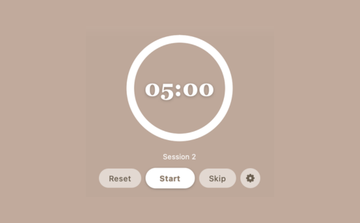

# Übersicht Pomodoro Timer Widget

A minimal, draggable Pomodoro timer for [Übersicht](http://tracesof.net/uebersicht/) — a circular countdown ring with focus/short-break/long-break cycling, sitting quietly on your desktop until you need it.

## Installation

1. Install [Übersicht](http://tracesof.net/uebersicht/) if you haven't already.
2. Download or clone this repo.
3. Copy `Pomodoro Timer.widget` into `~/Library/Application Support/Übersicht/widgets/`.
4. Refresh Übersicht (right-click the menu bar icon → Refresh, or `uebersicht://refresh-all`).

## Features

- A clean white countdown ring with the time in the center — no clutter until you need it.
- Click the ring to reveal Reset / Start / Skip / Settings; move the mouse away and they fade back out.
- Standard Pomodoro cycle: focus → short break, with a long break every 4th focus session.
- Settings panel lets you customize the focus/short-break/long-break durations in minutes.
- Drag the widget anywhere on screen — its position is remembered across restarts.
- State (current mode, time left, session count) and your custom durations persist in `localStorage`.

## Customizing

Open `Pomodoro Timer.widget/Pomodoro Timer.coffee` — colors, fonts, and layout live in the `style` block at the top, and the timer logic lives in `afterRender`. `MODE_INFO` and `DEFAULT_DURATIONS` are the easiest places to start if you want to change the default cycle or colors.
